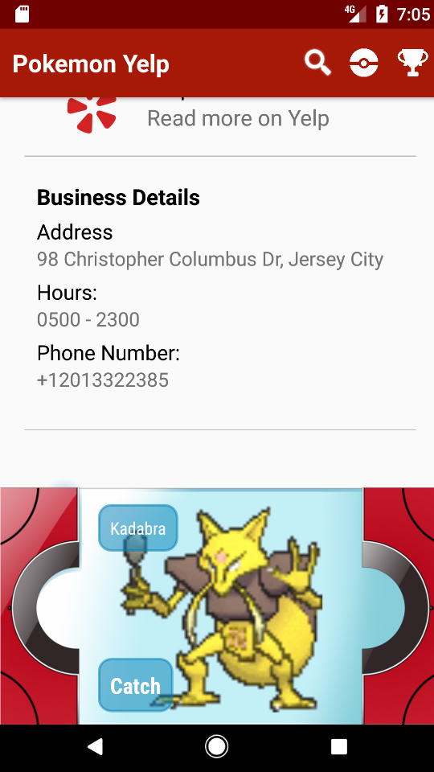
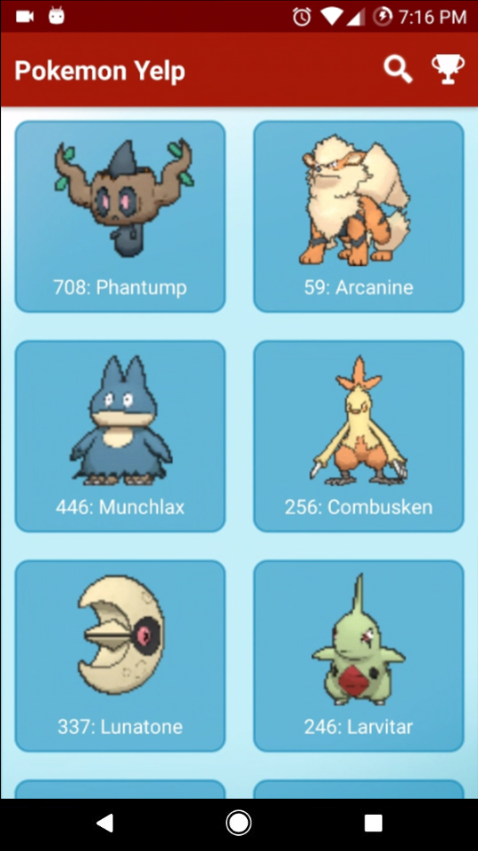

# Pokemon Yelp

## Overview

This is an app I worked on with other members of General Assembly for a group project. It is our take on what Pokemon Go should have been. In this App, you use the search function to find businesses using the Yelp API. When you select an individual store, you are given the ability to "scan" for a pokemon. When the pokemon appears at the store, it will remain there for an entire day (or 30 minutes in this test version). The user will need to physically go to the store, or very near it, to be able to capture the pokemon.

## Screenshots

   

 

## App features

- The app uses the Yelp API and the Pokemon API
- Search for Yelp businesses, just like a real Yelp App!
- Scan and catch pokemon
- View their pokemon collection

## Programming structure

- The app relies very heavily on API calls and google's location services
- Databases are used to persist user's pokemon collections and the pokemon locations
- A job scheduler is used to wipe pokemon locations every 30 minutes

## Copyright issues

- Nintendo will most likely sue us immediately. That is why this is not in the playstore.
- We used yelp's UI and Api but followed their display guidelines very strictly.

## Future plans

- Implementing a google games service to keep track of highscores (We tried to do one in the time limit but it only worked half the time)
- Use Firebase to persist user's pokemon collection in the cloud, so users can keep their collection even after the uninstall the game
- Use more logic so pokemon appearances make more sense. (Fighting types only appear at gyms, etc) and prevent rarer pokemon from showing up too frequently. (Right now, you can find a mew as easily as a pidgey, that is unacceptable.)

## Known issues

- Due to the uncertain nature of APIs, the app will sometimes load very slowly and pokemon scanning may not work all the time
- Yelp Token expires after a few hours and all the yelp functions will stop working until app is restarted
- Location service is not 100% predictable. Sometimes you could be sitting in the store a pokemon is at and not be able to capture it
- App crashes sometimes when the Yelp Api does not return something valid. (like empty coordinates)
